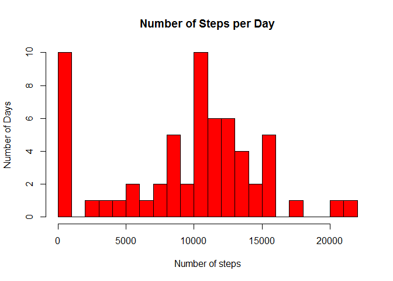
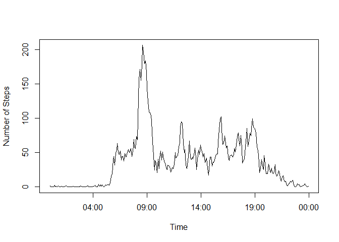
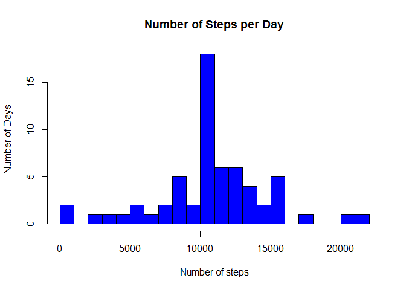
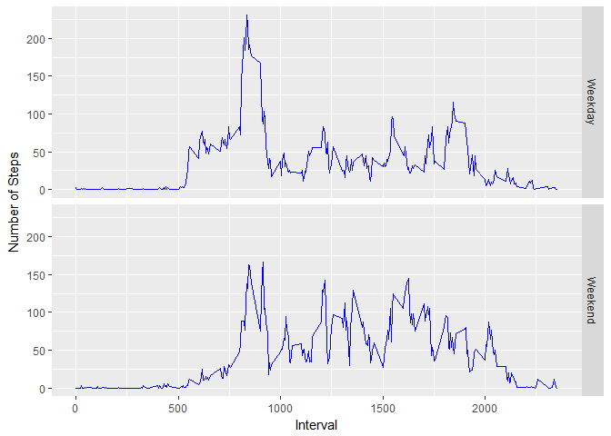

Note: The following packages are required: dplyr, lubridate, ggplot2. 
These are loaded initially, but that code chunk is masked for ease of 
reading. 

## Step 1 - Unzip & Read file


```r
download.file("https://d396qusza40orc.cloudfront.net/repdata%2Fdata%2Factivity.zip", "activity.zip")
tempfile <- unzip("activity.zip")
dat <- read.csv(tempfile)
```

## Step 2 - Calculate totals


```r
tots <- tapply(dat$steps, dat$date, sum, na.rm = TRUE)
tots <- as.vector(tots)
```

## Step 3 - Plot Histogram


```r
hist(tots, breaks = 20, col = "red", ylab = "Number of Days", xlab = "Number of steps", main = "Number of Steps per Day")
```

<!-- -->

## Step 4 - mean and median number of steps


```r
mean(tots) # This is the mean number of steps per day
```

```
## [1] 9354.23
```

```r
median(tots) # This is the median number of steps per day
```

```
## [1] 10395
```

## Step 5 Create Date/Time vector
Here adding a new column to the data with the actual time and date


```r
dat <- mutate(dat, dT = as.Date(as.character(dat[,2]), "%Y-%m-%d"))
hour(dat$dT) <- dat$interval%/%100; minute(dat$dT) <- dat$interval%%100
```

## Step 6 - plot line graph
First, find averages for each interval. Then plot against the time of day


```r
aves <- tapply(dat$steps, dat$interval, mean, na.rm = T)
plot(dat$dT[1:288], aves, type = "l", ylab = "Number of Steps", xlab = "Time")
```

<!-- -->

```r
## Which interval is highest?
which.max(tapply(dat$steps, dat$interval, mean, na.rm = T))
```

```
## 835 
## 104
```

## Step 7
Calculate number of NAs & Replace w/ mean for minute interval


```r
dat_repl <- dat

sum(is.na(dat$steps)) # This is the number of NA values
```

```
## [1] 2304
```

```r
for(i in 1: length(dat_repl$steps)) {
        if(is.na(dat_repl$steps[i])) {
                Y <- which(names(aves)==as.character(dat_repl$interval[i]))
                dat_repl$steps[i] <- as.numeric(aves[Y])
        }
}
```

## Step 8 - recompute totals, median, mean, replot histogram


```r
tots2 <- tapply(dat_repl$steps, dat_repl$date, sum, na.rm = TRUE)
tots2 <- as.vector(tots2)


hist(tots2, breaks = 20, col = "blue", ylab = "Number of Days", xlab = "Number of steps", main = "Number of Steps per Day")
```

<!-- -->

```r
mean(tots2)
```

```
## [1] 10766.19
```

```r
median(tots2)
```

```
## [1] 10766.19
```

## Step 9 - Add Weekday factor

```r
dat_repl$dT <- as.POSIXct(dat_repl$dT)
dat_repl <- mutate(dat_repl, weekday = wday(dT), weekend = 1)
#Add new column with weekday, and prepare a column for factor for weekend

dat_repl$weekend[dat_repl$weekday ==1] <- 2; dat_repl$weekend[dat_repl$weekday ==7] <- 2
dat_repl$weekend <- as.factor(dat_repl$weekend)
```

## Step 10 - Plot 2 panel linegraph

```r
# Initially find summary of mean steps per interval over both weekday/weekend
Sum_dat <- group_by(dat_repl, weekend, interval)
Plot_dat <- summarise(Sum_dat, steps1 = mean(steps))
Plot_dat$weekend <- as.factor(Plot_dat$weekend); levels(Plot_dat$weekend) <- c("Weekday" , "Weekend")
t <- ggplot(Plot_dat, aes(interval, steps1)) + geom_line(col = "blue") + facet_grid(weekend~.) + labs(x = "Interval", y = "Number of Steps")
print(t)
```

<!-- -->


